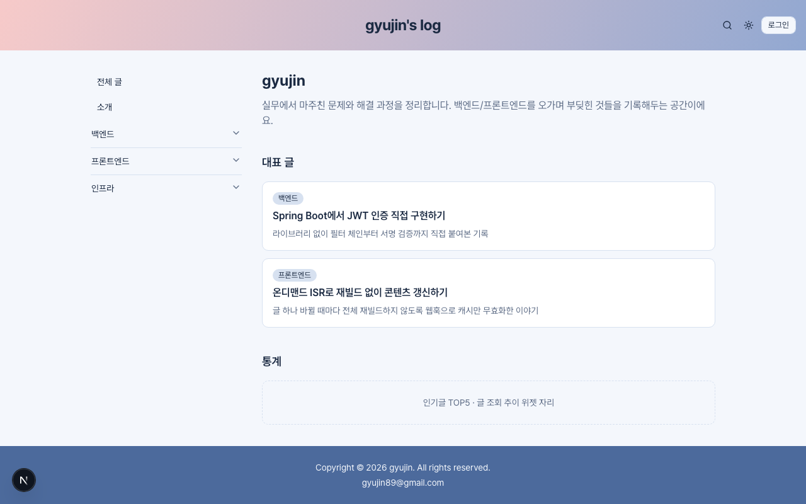
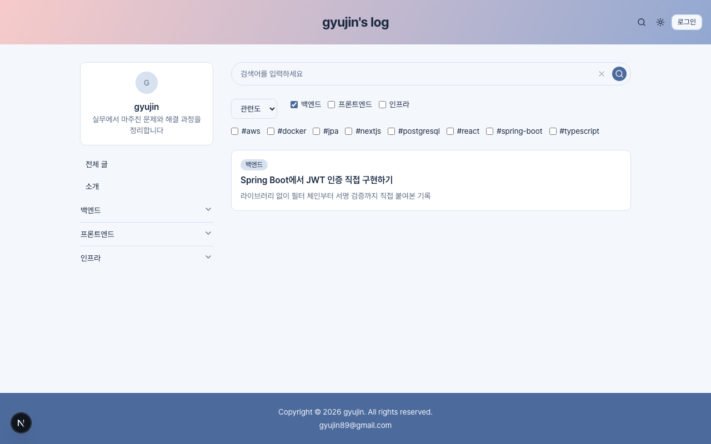
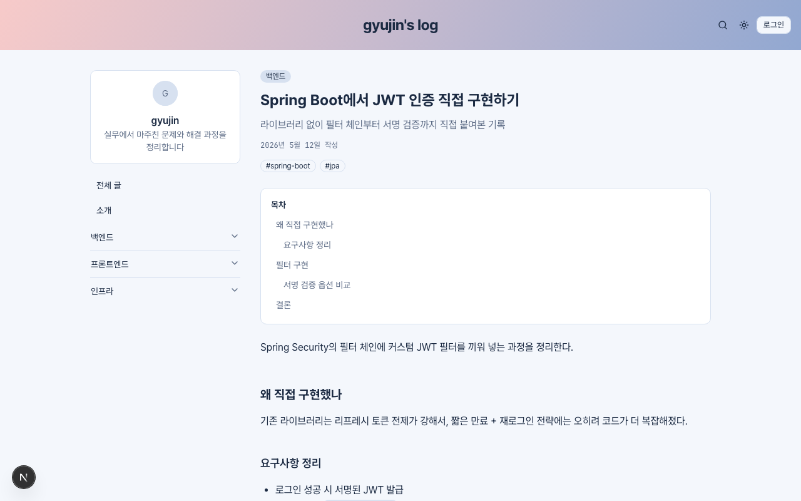
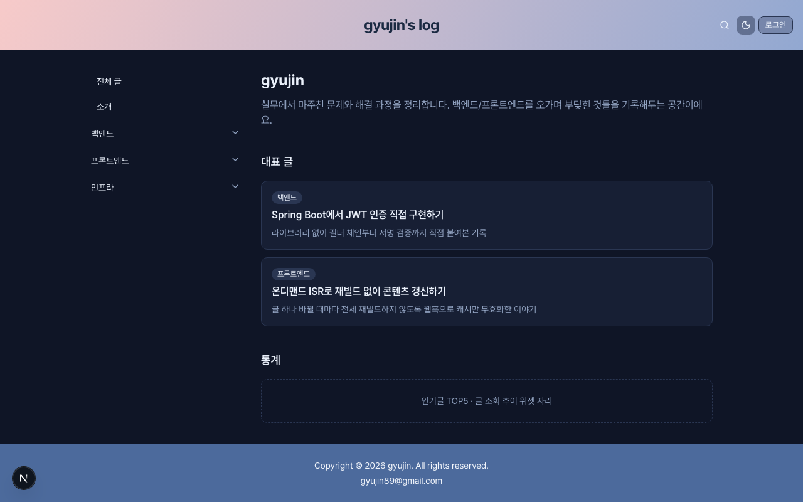
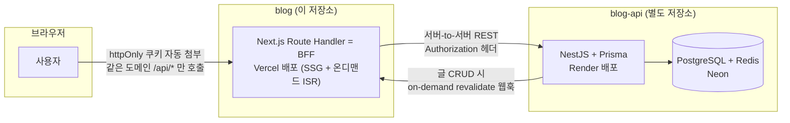

# gyujin's log

실무에서 마주친 문제와 해결 과정을 정리하는 개인 기술 블로그. 마크다운 글쓰기, 검색, 댓글, 좋아요, 조회수 통계까지 갖춘 풀스택 블로그를 Next.js(BFF) + NestJS(API) 두 저장소로 나눠 만들고 있습니다.

       

## 스크린샷

| 홈 | 검색 |
|---|---|
|  |  |

| 글 상세 | 다크 모드 |
|---|---|
|  |  |

## 데모

아직 배포 전입니다(`docs/blog-structure-plan.md`의 19번 체크리스트 — Vercel 프로젝트 연결 대기 중). 배포 후 이 자리에 링크를 채웁니다.

## 아키텍처



브라우저는 NestJS를 직접 호출하지 않고 항상 Next.js의 `app/api/*` Route Handler(BFF)만 호출합니다. 인증 토큰은 httpOnly 쿠키로만 오가며 브라우저 JS는 절대 값을 읽을 수 없습니다. 글 CRUD가 일어나면 백엔드가 프론트의 `/api/revalidate`를 호출해 해당 페이지만 즉시 재검증합니다(전체 재빌드 없음).

설계 배경과 각 결정의 이유(왜 BFF인지, 왜 NestJS인지, 왜 온디맨드 ISR인지 등)는 [`docs/blog-structure-plan.md`](docs/blog-structure-plan.md)에 자세히 정리되어 있습니다. 백엔드 설계는 [`blog-api`](https://github.com/QyujinLee/blog-api) 저장소의 `docs/blog-api-plan.md` 참고.

## 기술 스택

| 영역 | 선택 | 비고 |
|---|---|---|
| 프레임워크 | Next.js 16 (App Router) | Vercel 배포, SSG + 온디맨드 ISR |
| 언어 | TypeScript | strict |
| UI | shadcn(Base UI 기반) + Tailwind CSS 4 | 커스텀 컬러 팔레트("비주얼 아이덴티티" 섹션 참고) |
| 서버 상태 | TanStack Query v5 | 검색/댓글/좋아요/통계 등 CSR 데이터 전부 |
| 클라이언트 상태 | zustand | 로그인 모달 등 순수 UI 상태 (4차 예정) |
| 마크다운 | react-markdown + remark-gfm + rehype-pretty-code(Shiki) | 코드 하이라이트 + 복사 버튼 |
| 폼/검증 | 네이티브 HTML(`<select>`, `<input type="checkbox">`) | 계획에 없는 라이브러리는 안 씀 |
| 테스트 | Vitest(Browser Mode) + `vitest-browser-react`, Playwright | 유닛 + E2E |
| 문서화 | Storybook | 컴포넌트 독립 확인/문서화 |
| 백엔드(별도 저장소) | NestJS + Prisma, PostgreSQL(Neon) + Redis(Upstash), Render 웹서비스 배포 | REST API |

## 로컬 개발

```bash
yarn install
yarn dev        # http://localhost:3000
```

Node 버전은 `.nvmrc`(v24) 기준입니다. `nvm use`로 맞춰주세요.

### 테스트

```bash
yarn lint                              # ESLint
yarn tsc --noEmit -p tsconfig.json      # 타입체크
yarn test                              # Vitest 유닛 테스트 (컴포넌트 + Storybook 스토리)
yarn test:e2e                          # Playwright E2E (yarn dev 서버 자동 기동)
yarn build                             # 프로덕션 빌드
```

PR을 올리면 `.github/workflows/ci.yml`이 lint + 타입체크 + 유닛 테스트 + E2E 테스트를 자동으로 돌립니다.

## 진행 상황

현재 백엔드(`blog-api`) 연동 전 단계로, 글/카테고리 데이터는 `src/data/*.ts`의 목업을 사용합니다. 단계별 진행 상황과 남은 작업은 [`docs/blog-structure-plan.md`](docs/blog-structure-plan.md)의 "다음 단계" 체크리스트에서 확인할 수 있습니다.
